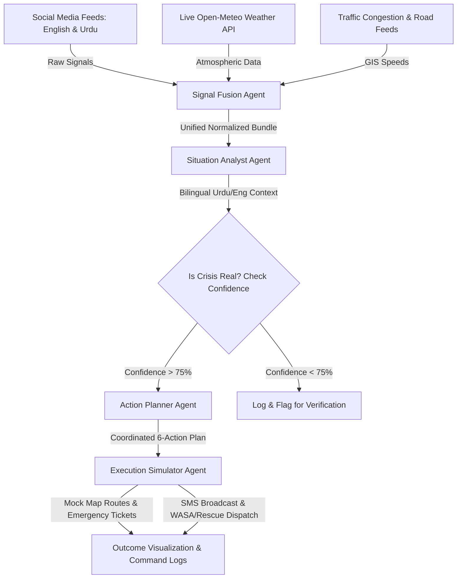

# 🇵🇰 CIRO: Crisis Intelligence & Response Orchestrator
### *An Agentic AI-Driven Emergency Response & Urban Intelligence Platform for Pakistan's Metropolitans*

---

## 🌟 Executive Summary

Metropolitans globally—and specifically in Pakistan (such as Karachi, Lahore, and Islamabad)—frequently face localized crises like **urban flooding (monsoon deluges)**, **lethal heatwaves**, **severe road blockages**, **major accidents**, and **infrastructure collapses**. Existing response systems are typically:
- ❌ **Fragmented** (agencies operate in silos)
- ❌ **Reactive** (dispatched after disaster escalates)
- ❌ **Slow to Coordinate** (rely on manual telephone lines and radio feeds)

**CIRO (Crisis Intelligence & Response Orchestrator)** solves this by building an end-to-end **Agentic AI System** powered by **Google Antigravity & Gemini 2.5**. It ingests multi-source signals (informal social media posts in Urdu and English, live weather reports, real-time traffic speeds), fuses them to identify emerging crises, plans localized multi-agency responses (WASA, Rescue 1122, Traffic Police, NDMA), and simulates execution outcomes in real time.

CIRO is built as a complete unified platform featuring:
1. 🏛️ **Disaster Response Command Center Dashboard (Admin Web View):** A high-tech cockpit with multi-agent trace timelines, dynamic GIS mapping, and automated execution logging.
2. 📱 **Citizen Super Portal (Mobile View):** A citizen-facing mobile application equipped with **Emergency SOS dials**, **live community reporting**, **AI-driven Photo-Lodge Complaint Maintenance** (which uses AI vision to prioritize garbage or sewerage issues), and a **Google Gemini Live Weather Intelligence briefing** (offering bilingual English and Urdu advisories with real-time text-to-speech voicing).

---

## 🏗️ System Architecture & Workflow

CIRO implements a structured, sequential **4-Agent Agentic Pipeline** orchestrated via Google Antigravity. The pipeline bridges raw, noisy environmental data to verified, simulated response operations.



### The 4-Agent Pipeline Breakdown

| Agent | Name | Core Responsibility | Tool Integration |
| :--- | :--- | :--- | :--- |
| **Agent 1** | **Signal Fusion Agent** | Ingests multi-source, noisy, informal textual and numeric inputs. Parses code-switched languages (Urdu + English), filters out noise, extracts location mentions, and outputs a normalized signal bundle. | `parse_social_signals()`, `extract_weather_data()`, `extract_traffic_data()`, `normalize_bundle()` |
| **Agent 2** | **Situation Analyst Agent** | Analyzes the fused signals, determines crisis type, severity level (low, medium, high, critical), confidence level, geolocates coordinates (latitude/longitude), and estimates population impact. | `cross_reference_signals()`, `classify_crisis_type()`, `calculate_confidence()`, `geo_locate()` |
| **Agent 3** | **Action Planner Agent** | Generates a 5-7 step coordinated response plan tailored to Pakistan's administrative framework (Rescue 1122, Traffic Police, NDMA, WASA, District Administration). | `query_available_resources()`, `calculate_optimal_routes()`, `assign_priority_matrix()`, `generate_action_plan()` |
| **Agent 4** | **Execution Simulator Agent** | Simulates step-by-step dispatch execution. Generates unique incident tickets, updates alternate mock routes, triggers public notifications, and computes before vs. after outcome metrics (e.g., congestion reduction). | `initialize_simulation()`, `execute_traffic_rerouting()`, `dispatch_emergency_units()`, `send_public_alerts()`, `compute_outcome_metrics()` |

---

## 🛠️ Tech Stack & Key Integrations

CIRO utilizes modern, high-performance web, AI, and browser-native interfaces to deliver a seamless, premium experience.

### 💻 Core Technical Stack
*   **Frontend Library:** **React (v18)** written in highly-structured **TypeScript** to ensure clean typings and compile-time correctness across all agent components.
*   **Build Tooling:** **Vite** for optimized assets compilation, fast Hot Module Replacement (HMR), and rapid local development builds.
*   **Routing Architecture:** **React Router DOM** handling all navigation and secure route guarding for different personas.
*   **Session & State Management:** **React Context API** (`AuthContext`) implementing real-time role-based access rules separating *Citizen Home* from *Command Center Dashboard*.
*   **Design & Styling System:** Responsive **Vanilla CSS** with a custom dark-glass and Pakistani emerald green color system. Utilizes responsive flex-grid wrappers, high-end CSS transitions, micro-animations, and animated status pulses.
*   **Deployment Configuration:** Pre-configured **Firebase Hosting** integration (`firebase.json`, `.firebaserc`) for seamless cloud hosting.

---

### 🔌 Real-Time Integrated APIs
CIRO features direct, production-grade integrations with live external services:

| API / Service / SDK | Target Integration Endpoint | Purpose & Utilization |
| :--- | :--- | :--- |
| **Google GenAI SDK** | `@google/genai` | Powering the 4-agent orchestrator utilizing the `gemini-2.5-flash-preview-05-20` model. It enforces strict structural outputs via JSON Mode to prevent schema drift between agent transitions. |
| **Open-Meteo Weather API** | `https://api.open-meteo.com/v1/forecast` | Programmatically fetches real-time coordinates-based atmospheric metrics: temperature, humidity, surface pressure, UV index forecasts, and hourly precipitation probabilities. |
| **OpenStreetMap Nominatim API** | `https://nominatim.openstreetmap.org/reverse` | Translates live client-side geolocation GPS coordinates (latitude/longitude) into human-readable Pakistani administrative locations and town landmarks. |
| **Web Speech Synthesis API** | Browser Native `window.speechSynthesis` | Localized native TTS text reader utilizing localized voice profiles (`ur-PK` and `en-US`) to vocalize bilingual weather summaries to stranded citizens. |
| **Firebase Auth API** | `firebase/auth` | Provides real-time user session state tracking. Supports Google Sign-In popups with automatic redirect fallbacks and standard Email/Password credentials. |
| **Firebase Firestore DB** | `firebase/firestore` | Live cloud database storing real-time citizen-submitted reports, emergency tickets, and command center log traces. |
| **Firebase Hosting API** | `ciro-ai-system.firebaseapp.com` | Pre-configured Firebase cloud hosting interface to deploy production client builds across secure SSL-encrypted public endpoints. |

---

### ⚙️ Simulated & Mock APIs
To simulate emergency workflows and municipal dispatches safely without sending false alerts to physical responders, CIRO implements simulated control loops:

*   **Simulated Traffic & Congestion API:** Models arterial traffic speeds, regional congestion rates (0–100%), and incident logs, enabling operators to see direct impacts of simulated reroutes.
*   **Simulated AI Computer Vision API:** Processes uploaded citizen photos under the hood, running simulated convolutional assessments to auto-extract garbage volume, sewerage leaks, or pothole severities.
*   **Simulated Resource Allocation & Ticket Ledger API:** Auto-creates structured maintenance tickets (`TKT-XXXXX`), maps diversion alternates (e.g., routing G-10 commuters via Margalla Road), and tracks mock asset coordinates (e.g., WASA pump trucks and Rescue 1122 ambulances).

---

## 📱 Citizen App vs. 🏛️ Admin Dashboard Features

CIRO is built with a dual-persona design system styled in a modern **Glassmorphic Gold, Pakistan Emerald Green, and Dark Slate** color scheme.

### 📱 Citizen Super Portal (Mobile View)
*   **Emergency Speed Dial:** Direct linkages to Pakistan's key lifelines (Rescue 1122, Police 15, Edhi 115, Fire Brigade 16) styled with vibrant, responsive branding.
*   **Intelligent Weather Brief (Google Weather Panel):** Clickable badge displaying local temperature and sky state. Renders a comprehensive, expandable drawer containing custom Gemini advisories in English and Urdu, tailored dressing tips (e.g., lightweight lawn cotton for Karachi heatwave), and localized text-to-speech audio controls.
*   **AI Smart Maintenance Lodge:** Permits camera uploads of localized infrastructure failure. Features simulated computer-vision analysis with realistic time delays, indicating hazard levels and issuing submission tickets.
*   **Community Live Feeds & Interactive Map:** Dynamic grid showcasing community reports alongside a GIS-based Map displaying active localized hazards.
*   **Floating Panic SOS Button:** Instant dispatch signal that triggers an alert and routes live GPS coordinates to WASA and Rescue 1122 control desks.

### 🏛️ Disaster Command Center (Admin View)
*   **Live Input Configurator:** Allows emergency operators to choose between predefined crisis scenarios (e.g., *Flash Flood at G-10 Markaz*, *Heatwave in Karachi*, *Major Pileup on Lahore Motorway*) or input custom WhatsApp, Facebook, or Twitter text signals.
*   **Agent Trace Panel:** Displays real-time, chronological steps, reasoning logs, and toolcalls made by the 4 Antigravity Agents as they operate.
*   **Action Planner & Simulation Panel:** Outputs detailed response lists with designated responsible units (e.g., WASA High-Capacity Pumps, Traffic Wardens) and updates simulation states sequentially (Pending ➡️ Executing ➡️ Completed).
*   **Outcome Dashboard:** Compares "Before vs. After" states, showcasing statistical success in simulation: congestion drops, response times, units deployed, alerts broadcast, and lives impacted.

---

## 📂 Project Structure

```text
ciro/
├── public/                 # Static assets and icons
├── src/
│   ├── agents/             # The Core 4-Agent Orchestration Pipeline
│   │   ├── actionPlannerAgent.ts       # Agent 3: Action & priority planner
│   │   ├── executionSimulatorAgent.ts  # Agent 4: Execution & outcome simulator
│   │   ├── mockData.ts                  # High-fidelity mock fallback data
│   │   ├── orchestrator.ts              # Pipeline coordinator & scenario triggers
│   │   ├── signalFusionAgent.ts        # Agent 1: Signal normalizer & translator
│   │   └── situationAnalystAgent.ts     # Agent 2: Classifier & severity evaluator
│   ├── components/         # Reusable dashboard, map, and status components
│   ├── constants/          # App constants (images, colors)
│   ├── context/            # AuthContext (distinguishing Admin vs. Citizen)
│   ├── pages/              # High-fidelity page layouts
│   │   ├── CitizenHomePage.tsx          # Citizen Mobile App (Super App)
│   │   ├── DashboardPage.tsx            # Admin Web Dashboard (Command Center)
│   │   ├── LandingPage.tsx              # Gate-keeping landing interface
│   │   ├── LoginPage.tsx                # Secure access login
│   │   ├── LogsPage.tsx                 # Agent Audit Logs view
│   │   └── MapPage.tsx                  # Standalone full GIS map view
│   ├── services/           # External API endpoints
│   │   └── weatherService.ts            # Live Weather & Gemini Weather Briefing
│   ├── types.ts            # Strict TypeScript models and interfaces
│   ├── App.tsx             # Main routing and global state controller
│   └── index.css           # Premium Vanilla CSS tokens and custom styling
├── package.json            # Client dependencies
└── vite.config.ts          # Build configuration
```

---

## 🚀 Getting Started & Local Setup

To launch CIRO locally on your workstation, follow these steps:

### Prerequisites
- Node.js (v18.0.0 or higher)
- npm or yarn

### 1. Install Dependencies
```bash
# Clone the repository and navigate to its root directory
npm install
```

### 2. Configure Environment Variables
Create a `.env` file at the root of the project and add your Google Gemini API key:
```env
VITE_GEMINI_API_KEY="your-google-gemini-api-key-here"
```
> 💡 *Note: If no API key is specified, CIRO automatically falls back to high-fidelity mock scenario runs, allowing full demo capabilities and offline evaluations!*

### 3. Run the Development Server
```bash
npm run dev
```
Open [http://localhost:5173](http://localhost:5173) in your browser to interact with the application.

### 4. Switch Between Personas
CIRO supports full Multi-Tenancy! When logging in, select:
- 🧑 **Citizen Portal (Mobile View):** Directs you to the localized Mobile Super App.
- 👮 **Command Center (Admin Web View):** Directs you to the high-tech administrative dashboard.

---

## 🛡️ Safety, Guardrails & Assumptions

1. **Simulated Dispatches:** All emergency tickets, ambulance routings, and SMS broadcasting metrics are simulated internally. The platform does *not* trigger actual live emergency notifications to official Pakistani service units (e.g., Rescue 1122 or NDMA) to prevent false dispatches.
2. **API Resiliency:** If Gemini API quotas are reached or a network error occurs, the orchestrator instantly performs a seamless fallback to the pre-compiled `mockData.ts` to ensure zero application crashes.
3. **No Sensitive PII Data:** Social media signals are randomized and structured to exclude any real-world personally identifiable information (PII) or sensitive telemetry.
4. **Code-Switching Adaptation:** The Signal Fusion Agent assumes that Urdu text might be written in either standard Arabic script (نستعلیق) or Roman Urdu (e.g., "pani bhar gaya hai"). The model has been pre-prompted with Pakistani colloquialisms to handle both seamlessly.
